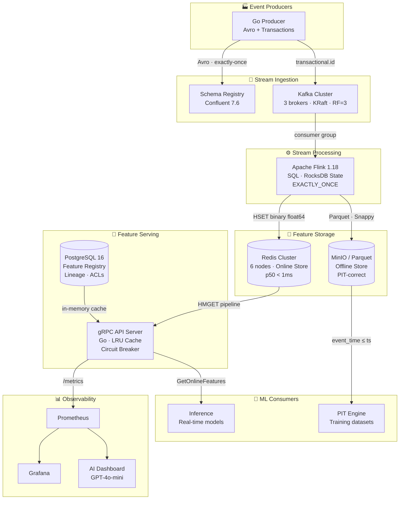
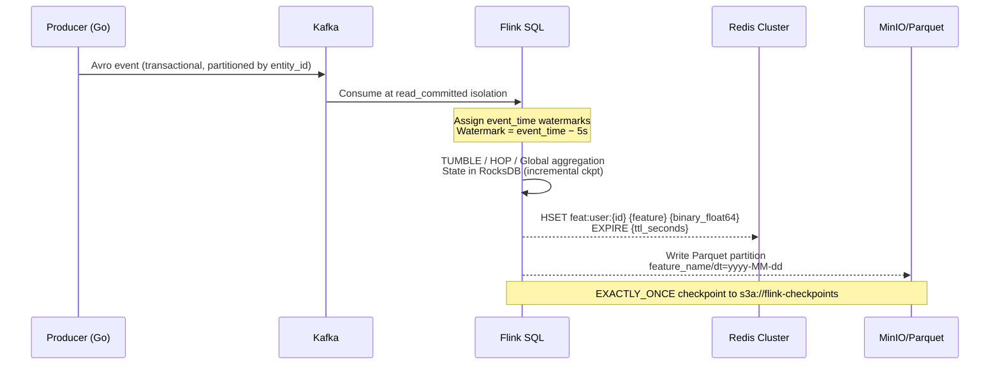
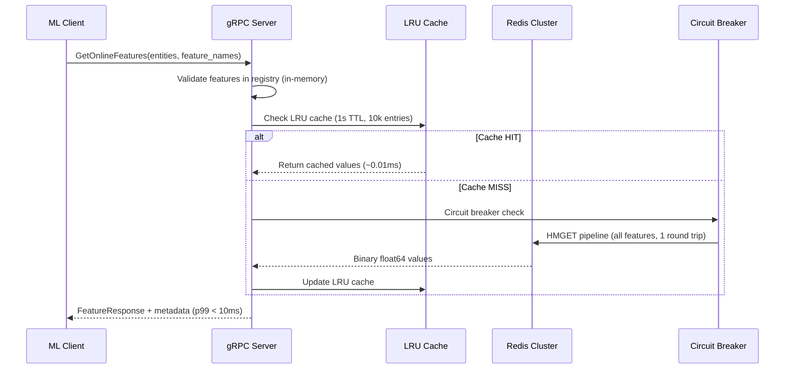
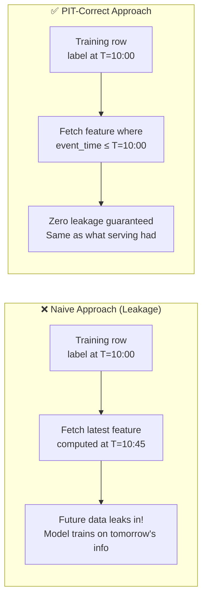
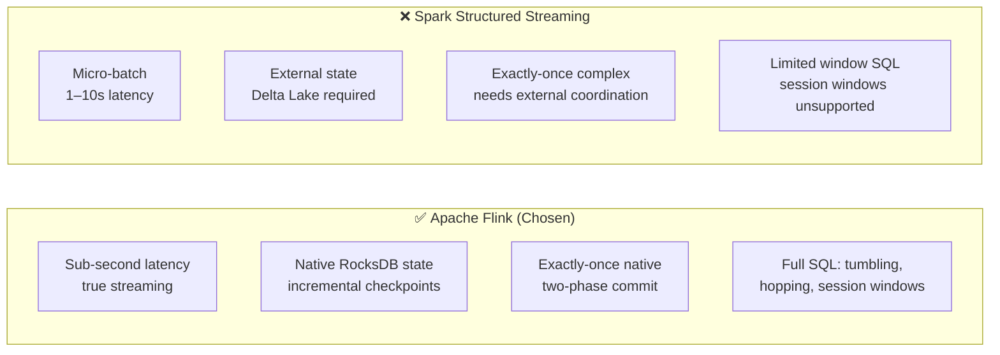
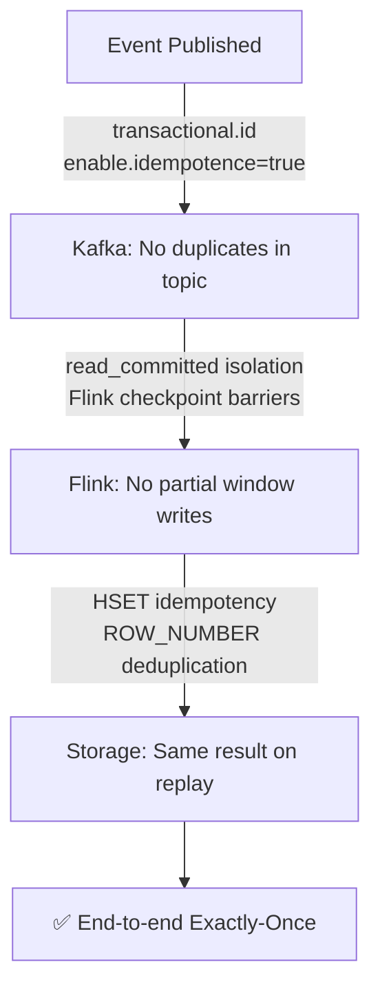

<div align="center">

# ⚡ StreamFeature

### Real-Time Feature Store Engine — Built From First Principles

[](https://go.dev)
[](https://openjdk.org)
[](https://flink.apache.org)
[](https://kafka.apache.org)
[](https://redis.io)
[](https://postgresql.org)
[](LICENSE)

**A production-grade, distributed feature store that ingests streaming events from Kafka, computes incremental SQL materialized views with Apache Flink, serves features at p99 < 10ms via gRPC, and guarantees point-in-time correctness for ML training — with zero data leakage.**

[Quick Start](#-quick-start) · [Architecture](#-architecture) · [API Reference](#-api-reference) · [SLA Targets](#-sla-targets) · [Design Decisions](#-design-decisions--trade-offs)

</div>

---

## 📋 Table of Contents

- [Overview](#-overview)
- [Architecture](#-architecture)
- [Tech Stack](#-tech-stack)
- [Project Structure](#-project-structure)
- [Quick Start](#-quick-start)
- [Feature Definition DSL](#-feature-definition-dsl)
- [API Reference](#-api-reference)
- [SLA Targets](#-sla-targets)
- [Observability](#-observability)
- [Design Decisions & Trade-offs](#-design-decisions--trade-offs)
- [Running Tests](#-running-tests)

---

## 🎯 Overview

StreamFeature solves the core ML infrastructure problem: **features computed differently at training time vs. serving time causes model degradation in production**.

It provides a single, unified engine that:

- **Computes features once** (Flink SQL) and serves them both online (Redis) and offline (Parquet)
- **Guarantees point-in-time correctness** — no future data leaks into training sets
- **Delivers features in < 10ms p99** — suitable for real-time inference at 10k+ RPS
- **Provides exactly-once semantics** end-to-end — Kafka transactions → Flink checkpoints → Redis HSET idempotency

---

## 🏗️ Architecture

### System Overview



### Data Flow: Streaming Path



### Data Flow: Serving Path



### Point-in-Time Correctness



---

## 🛠️ Tech Stack

| Component | Technology | Version | Why |
|-----------|-----------|---------|-----|
| Message Broker | Apache Kafka (KRaft) | 3.7 / Confluent 7.6 | Exactly-once transactions, no ZooKeeper |
| Stream Processor | Apache Flink | **1.18.1 LTS** | Native RocksDB state, sub-second latency, SQL |
| State Backend | RocksDB (embedded) | Flink-managed | Incremental checkpoints → low S3 overhead |
| Online Store | Redis Cluster | **7.2 LTS** | p50 ~0.5ms, native cluster failover < 5s |
| Offline Store | Parquet on MinIO | Latest stable | 100× cheaper than RDS, partition pruning |
| Feature Registry | PostgreSQL | **16 LTS** | JSONB indexes, lineage queries, ACLs |
| API Server | Go + gRPC | **1.22 LTS** | Goroutines per entity, zero-copy Redis reads |
| AI Dashboard | FastAPI + OpenAI | GPT-4o-mini | Natural language SRE analysis |
| Observability | Prometheus + Grafana + Jaeger | Latest stable | Full metrics, traces, auto-provisioned dashboards |

---

## 📁 Project Structure

```
StreamFeature/
└── feature-store-engine/
    ├── docker-compose.yml          # All infra: Kafka, Redis, Postgres, MinIO, Flink, monitoring
    ├── Makefile                    # Every command you need
    ├── .env.example                # All environment variables documented
    │
    ├── proto/                      # gRPC API definitions
    │   └── feature_service.proto   # FeatureService + RegistryService
    │
    ├── schemas/                    # Event schemas
    │   └── user_events.avsc        # Avro schema (Confluent wire format)
    │
    ├── features/                   # Feature view definitions (YAML DSL)
    │   └── user_engagement.yaml    # 5 features: tumbling, hopping, global
    │
    ├── flink-jobs/                 # Apache Flink streaming jobs (Java 17 / Maven)
    │   ├── pom.xml                 # Flink 1.18.1, Kafka, RocksDB, Parquet, S3
    │   └── src/main/java/com/featurestore/jobs/
    │       ├── FeatureJobRunner.java     # Main job: DDL gen, EXACTLY_ONCE config
    │       ├── FeatureViewDefinition.java # YAML → POJO mapper
    │       ├── FeatureDefinition.java    # Per-feature model
    │       └── JobConfig.java           # CLI arg parser
    │
    ├── backfill/                   # Flink BATCH mode backfill engine (Java)
    │   ├── pom.xml
    │   └── src/main/java/com/featurestore/backfill/
    │       ├── BackfillRunner.java       # ROW_NUMBER deduplication, S3 read/write
    │       └── RedisBackfillSink.java    # HSET pipeline sink (idempotent)
    │
    ├── producer/                   # Kafka event producer (Go)
    │   └── cmd/producer/main.go    # Avro + transactional + out-of-order injection
    │
    ├── api-server/                 # gRPC feature serving layer (Go)
    │   ├── cmd/server/main.go      # Server bootstrap, metrics, graceful shutdown
    │   └── internal/
    │       ├── store/              # Redis Cluster client, LRU, circuit breaker
    │       ├── registry/           # PostgreSQL client, in-memory feature cache
    │       └── handlers/           # gRPC handlers + interceptors
    │
    ├── pit-engine/                 # Point-in-time correct dataset generator (Go)
    │   └── cmd/main.go             # MinIO scan + PIT join + leakage prevention
    │
    ├── registry/                   # Feature registry
    │   ├── migrations/001_init.sql # Schema: views, lineage, versions, ACLs
    │   └── api/main.go             # REST API: CRUD + impact analysis + versioning
    │
    ├── observability/
    │   ├── prometheus/
    │   │   ├── prometheus.yml      # Scrape configs (API, Kafka, Redis, Flink, PG)
    │   │   └── alerting_rules.yml  # 9 alert rules covering all SLAs
    │   └── grafana/dashboards/
    │       ├── dashboard.yml       # Grafana auto-provisioning config
    │       └── featurestore.json   # 11 panels: SLA stats, latency trends, cache, freshness
    │
    ├── ai-dashboard/               # AI monitoring dashboard (Python)
    │   ├── main.py                 # FastAPI + WebSocket + OpenAI GPT-4o-mini
    │   └── requirements.txt
    │
    ├── e2e-tests/                  # Integration tests (Go)
    │   ├── tests/
    │   │   ├── integration_test.go # Incremental, exactly-once, 10k RPS load test
    │   │   └── parity_test.go      # Online/offline parity checker (1e-9 tolerance)
    │   └── fixtures/users.csv      # Sample entity-timestamps for PIT testing
    │
    └── docs/
        └── ARCHITECTURE.md         # Deep-dive: data flows, state mgmt, design decisions
```

---

## 🚀 Quick Start

### Prerequisites

```bash
# macOS
brew install go maven protobuf protoc-gen-go protoc-gen-go-grpc

# Docker Desktop must be running (allocate ≥ 8GB RAM)
```

### 1. Configure environment

```bash
cd feature-store-engine
cp .env.example .env
# Edit .env → add your OPENAI_API_KEY
```

### 2. Start all infrastructure

```bash
make infra-up

# Waits for all services to be healthy
make health-check
```

Services started:
| Service | URL |
|---------|-----|
| Kafka UI | http://localhost:8080 |
| Flink UI | http://localhost:8082 |
| Grafana | http://localhost:3000 (admin/admin123) |
| MinIO | http://localhost:9001 (minioadmin/minioadmin123) |
| Jaeger | http://localhost:16686 |
| AI Dashboard | http://localhost:8888 |

### 3. Apply database migrations

```bash
make db-migrate
```

### 4. Register a feature view

```bash
make register-feature file=features/user_engagement.yaml
```

### 5. Build and deploy the Flink streaming job

```bash
make flink-build
make flink-run feature_view=user_engagement
```

### 6. Produce events and watch features compute

```bash
# Stream 100k events with 10% out-of-order ratio (watermark testing)
make produce-test-events count=100000 out_of_order_ratio=0.1

# Verify features appear in Redis within 2s of window close
make verify-incremental feature=click_count_1h
```

### 7. Start the gRPC serving layer

```bash
make api-build
make api-run
```

### 8. Query features (grpcurl)

```bash
grpcurl -plaintext -proto proto/feature_service.proto \
  -d '{
    "feature_names": ["click_count_1h", "avg_session_duration_24h"],
    "entities": [{"entity_type": "user", "entity_id": "user_123"}]
  }' \
  localhost:50051 featurestore.FeatureService/GetOnlineFeatures
```

### 9. Generate a PIT-correct training dataset

```bash
make pit-dataset \
  entities=e2e-tests/fixtures/users.csv \
  features=click_count_1h,avg_session_duration_24h \
  output=train.csv
```

### 10. Start the AI monitoring dashboard

```bash
make ai-dashboard
# → http://localhost:8888
# Chat with GPT-4o-mini about your metrics!
```

---

## 📝 Feature Definition DSL

Features are defined in YAML — the same definition drives both streaming and offline:

```yaml
# features/user_engagement.yaml
feature_view: user_engagement
entities:
  - name: user_id
    type: string

source:
  type: kafka
  topic: user_events
  watermark: "event_time - INTERVAL '5' SECOND"   # 5s out-of-order tolerance

features:
  - name: click_count_1h
    sql: |
      SELECT user_id, COUNT(*) AS click_count_1h,
             TUMBLE_END(event_time, INTERVAL '1' HOUR) AS window_end
      FROM user_events WHERE event_type = 'click'
      GROUP BY user_id, TUMBLE(event_time, INTERVAL '1' HOUR)
    aggregation: tumbling_window
    ttl: 24h

  - name: avg_session_duration_24h
    sql: |
      SELECT user_id, AVG(session_duration) AS avg_session_duration_24h
      FROM user_events
      GROUP BY user_id, HOP(event_time, INTERVAL '1' HOUR, INTERVAL '24' HOUR)
    aggregation: hopping_window
    ttl: 7d
```

---

## 📡 API Reference

### gRPC Feature Service

| Method | Description |
|--------|-------------|
| `GetOnlineFeatures` | Fetch features for N entities in parallel (p99 < 10ms) |
| `GetHistoricalFeatures` | Stream features for entity-timestamp pairs |
| `StreamFeatures` | Real-time feature subscription |
| `HealthCheck` | Liveness + Redis + registry health |

### Registry REST API (`:8090`)

| Method | Endpoint | Description |
|--------|----------|-------------|
| `GET` | `/api/v1/features` | List all feature views (filter by `?entity=user`) |
| `POST` | `/api/v1/features` | Register or update a feature view |
| `GET` | `/api/v1/features/{name}` | Get a specific feature definition |
| `DELETE` | `/api/v1/features/{name}` | Soft-delete (preserves history) |
| `GET` | `/api/v1/features/{name}/lineage` | Upstream source lineage |
| `GET` | `/api/v1/impact?source=kafka:user_events` | **Impact analysis**: which features break if source changes? |
| `GET` | `/api/v1/features/{name}/versions` | Immutable version history |

---

## 📊 SLA Targets

| Metric | Target | Measurement |
|--------|--------|-------------|
| End-to-end latency (event → feature) | **< 5s** | `ingestion_time − event_time` |
| Serving p50 latency | **< 2ms** | gRPC histogram |
| Serving p99 latency | **< 10ms** | gRPC histogram |
| Throughput (serving) | **> 10k RPS** | k6 load test |
| Throughput (ingestion) | **> 50k events/sec** | Kafka producer metrics |
| Feature freshness | **< 5s behind Kafka** | `featurestore_feature_freshness_seconds` |
| Availability | **> 99.9%** | Uptime over 7-day chaos test |
| Training data leakage | **0 violations** | Automated PIT parity check |

---

## 📈 Observability

### Prometheus Alert Rules

| Alert | Condition | Severity |
|-------|-----------|----------|
| `ServingP99HighLatency` | p99 > 50ms for 2m | warning |
| `ServingP99CriticalLatency` | p99 > 100ms for 1m | critical |
| `HighErrorRate` | error% > 0.1% for 2m | critical |
| `FeatureStaleData` | freshness > 30s for 2m | warning |
| `FeatureCriticallyStale` | freshness > 5min | critical |
| `CircuitBreakerOpen` | Redis CB = OPEN | critical |
| `KafkaConsumerLag` | lag > 1000 msgs | warning |
| `FlinkCheckpointFailure` | any failure | critical |

### Grafana Dashboard

Auto-provisioned on startup with 11 panels across 3 rows:

- **SLA Overview**: p99, p50, error rate, RPS, freshness, circuit breaker — color-coded against targets
- **Latency Trends**: p50/p95/p99 + Redis p50/p99 timeseries
- **Cache & Throughput**: LRU hit rate, request throughput, per-feature freshness

### AI Dashboard

```bash
make ai-dashboard   # → http://localhost:8888
```

Chat with GPT-4o-mini about your system in real time:
- _"Why is my p99 latency spiking?"_
- _"What's the impact of the Kafka consumer lag?"_
- _"Summarize the last 5 minutes of system health"_

Auto-alerts fire when SLA breaches are detected.

---

## ⚙️ Design Decisions & Trade-offs

### Why Flink over Spark Structured Streaming?



### Why Redis over Cassandra for Online Store?

| Criterion | Redis Cluster | Cassandra |
|-----------|--------------|-----------|
| p50 read latency | **~0.5ms** | ~2–5ms |
| Cluster failover | **< 5s** | Eventual consistency |
| Operational complexity | Low | High (tuning-intensive) |
| Memory cost | Higher | Lower |
| **Verdict** | **Winner for < 10ms SLA** | Better for large-scale cold reads |

**Mitigation**: TTLs + binary float64 encoding reduce Redis memory by ~30% vs string storage.

### Why Binary float64 in Redis?

```
String: "42.5678"           → 7+ bytes + string parsing overhead
Binary: <8-byte IEEE 754>   → exactly 8 bytes, zero-copy decode
```

Same encoding in Go (`encoding/binary`) and Java (`ByteBuffer.putDouble`) ensures no conversion errors across the pipeline.

### Why Parquet + MinIO over a Database for Offline Store?

| Criterion | Parquet on MinIO | PostgreSQL / RDS |
|-----------|-----------------|-----------------|
| Storage cost | ~$0.023/GB/month | ~$0.115/GB/month |
| PIT query performance | Partition pruning on `dt` | Full table scan |
| Write pattern | Append-only (Flink native) | UPSERT (extra ETL) |
| Deduplication | ROW_NUMBER() window | ON CONFLICT |
| **Verdict** | **~5× cheaper, Flink-native** | Better for complex joins |

### Watermarking Trade-off

```
Watermark delay = 5 seconds

✅ Events ≤ 5s late  → Processed in correct window
⚠️  Events > 5s late  → Routed to side output (logged, not silently dropped)
📊 Trade-off: Lower delay = fresher features, more late data dropped
              Higher delay = more complete windows, higher end-to-end latency
```

### Exactly-Once: Three-Layer Defense



---

## 🧪 Running Tests

```bash
# Unit tests only (no infra required)
make test-unit

# Full integration suite (requires make infra-up)
make test-all

# Specific test suites
go test ./e2e-tests/tests/... -run TestIncremental    # Feature write/read
go test ./e2e-tests/tests/... -run TestExactlyOnce    # Deduplication check
go test ./e2e-tests/tests/... -run TestOnlineOfflineParity  # Skew detection
go test ./e2e-tests/tests/... -run TestLoad           # 10k RPS benchmark

# Load test (requires API server running)
make load-test rps=10000 duration=5m

# Verify exactly-once after chaos
make inject-events count=1000000
make chaos-kill-flink
make flink-restore
make verify-exactly-once

# Run backfill for historical data
make flink-backfill feature_view=user_engagement start=2024-01-01 end=2024-01-07
```

---

## 🔑 Environment Variables

Copy `.env.example` → `.env` and configure:

| Variable | Default | Description |
|----------|---------|-------------|
| `OPENAI_API_KEY` | **required** | GPT-4o-mini for AI dashboard |
| `KAFKA_BROKERS` | `localhost:9092,...` | Kafka bootstrap servers |
| `REDIS_ADDRS` | `localhost:7001,...` | Redis cluster nodes |
| `POSTGRES_DSN` | See `.env.example` | Feature registry DB |
| `MINIO_ENDPOINT` | `http://localhost:9000` | S3-compatible offline store |
| `FLINK_REST_URL` | `http://localhost:8082` | Flink job submission endpoint |

---

<div align="center">

*Built with intent. No shortcuts. Ship the engine, not the wrapper.*

**[⬆ Back to top](#-streamfeature)**

</div>
